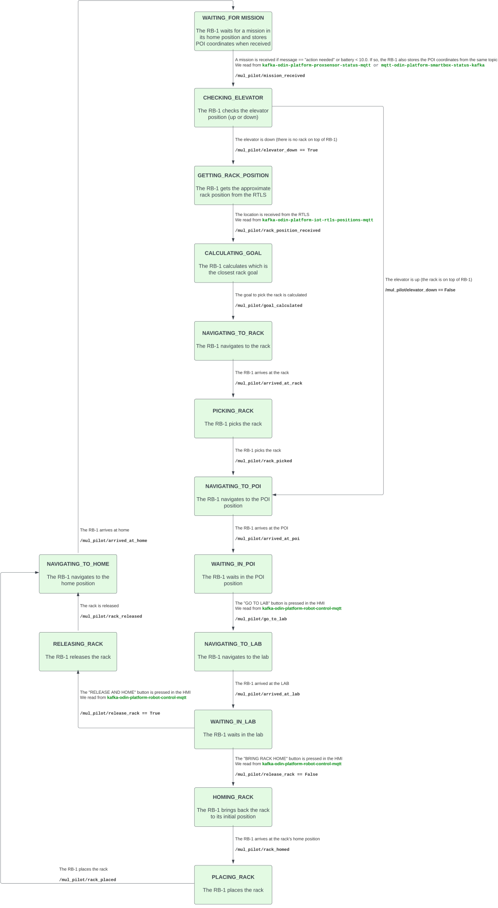

# sermas_pilot

The sermas_pilot package, based on RComponent structure. This package contains the necessary node to run during the SERMAS pilot of the [ODIN project](https://odin-smarthospitals.eu/) in February 2024.

## Installation

~~(Optional)~~

## 1 sermas_pilot_node

This node implements the RB-1's state machine. The default state when starting the node is **WAITING_FOR_MISSION.**

  

### 1.1 Parameters

* **/sermas_pilot/proxsensor_sub (string, default: /sermas_pilot/proxsensor)**\
  Topic for subscribing to proximity sensor data.

* **/sermas_pilot/rtls_sub (string, default: /sermas_pilot/RTLS)**\
  Topic for subscribing to Real-Time Location System data.

* **/sermas_pilot/smartbox_sub (string, default: /sermas_pilot/smartbox)**\
  Topic for subscribing to smartbox status data.

* **/sermas_pilot/hmi_sub (string, default: /sermas_pilot/hmi)**\
  Topic for subscribing to HMI data.

* **/sermas_pilot/elevator_sub (string, default: /robot/robotnik_base_control/elevator_status)**\
  Topic for subscribing to elevator status data.

* **/sermas_pilot/pick_sequence (string, default: PICK_SEQUENCE)**\
  Defines the pick sequence.

* **/sermas_pilot/place_sequence (string, default: PLACE_SEQUENCE)**\
  Defines the place sequence.

* **/sermas_pilot/release_sequence (string, default: RELEASE_SEQUENCE)**\
  Defines the release sequence.
   
### 1.2 Subscribed Topics

* **/sermas_pilot/proxsensor (odin_msgs/ProxSensor)**\
  If the string "action needed" is received in the `data.message` field and the current state is **WAITING_FOR_MISSION,** the state is changed to **CHECKING_ELEVATOR.** The coordinates the subfields `Posx` and `Posy` of the `data` field are stored as the POI coordinates.

* **/sermas_pilot/smartbox (odin_msgs/SmartboxStatus)**\
  If the message value received in the `data.battery` field is below 10.0 and the current state is **WAITING_FOR_MISSION,** the state is changed to **CHECKING_ELEVATOR.**

* **/sermas_pilot/RTLS (odin_msgs/RTLS)**\
  From this topic we obtain the coordinates where the robot must navigate if it is in the **GETTING_RACK_POSITION** state. We retrieve them from the `data.x`, `data.y` and `data.z` fields.

* **/sermas_pilot/hmi**\
  From this topic we read the command sent via the ODIN HMI in the `data.taskType` field. It can contain one of the following strings presumably:
  * "GO TO LAB" if we are in **WAITING_IN_POI** state, or
  * "RELEASE AND HOME" or "BRING RACK HOME" if we are in **WAITING_IN_LAB** state.

### 1.3 Published Topics

* ~~foo/topic_name (std_msgs/String)\
  topic description, including any important rate information~~

### 1.4 Services

Services are provided for the transition between states:

* **/sermas_pilot/mission_received (std_srvs/Trigger)**\
  Allows the change from **WAITING_FOR_MISSION** to **CHECKING_ELEVATOR.**

* **/sermas_pilot/elevator_down (std_srvs/SetBool)**\
  Allows the change from **CHECKING_ELEVATOR** to **GETTING_RACK_POSITION** if true, or to **NAVIGATING_TO_POI** if false.

* **/sermas_pilot/rack_position_received (std_srvs/Trigger)**\
  Allows the change from **GETTING_RACK_POSITION** to **CALCULATING_GOAL.**

* **/sermas_pilot/goal_calculated (std_srvs/Trigger)**\
  Allows the change from **CALCULATING_GOAL** to **NAVIGATING_TO_RACK.**

* **/sermas_pilot/arrived_at_rack (std_srvs/Trigger)**\
  Allows the change from **NAVIGATING_TO_RACK** to **PICKING_RACK.**

* **/sermas_pilot/rack_picked (std_srvs/Trigger)**\
  Allows the change from **PICKING_RACK** to **NAVIGATING_TO_POI.**

* **/sermas_pilot/arrived_at_poi (std_srvs/Trigger)**\
  Allows the change from **NAVIGATING_TO_POI** to **WAITING_IN_POI.**

* **/sermas_pilot/go_to_lab (std_srvs/Trigger)**\
  Allows the change from **WAITING_IN_POI** to **NAVIGATING_TO_LAB.**

* **/sermas_pilot/arrived_at_lab (std_srvs/Trigger)**\
  Allows the change from **NAVIGATING_TO_LAB** to **WAITING_IN_LAB.**

* **/sermas_pilot/release_rack (std_srvs/SetBool)**\
  Allows the change from **WAITING_IN_LAB** to **HOMING_RACK** if false, or to **RELEASING_RACK** if true.

* **/sermas_pilot/rack_homed (std_srvs/Trigger)**\
  Allows the change from **HOMING_RACK** to **PLACING_RACK.**

* **/sermas_pilot/rack_placed (std_srvs/Trigger)**\
  Allows the change from **PLACING_RACK** to **NAVIGATING_TO_HOME.**

* **/sermas_pilot/rack_released (std_srvs/Trigger)**\
  Allows the change from **RELEASING_RACK** to **NAVIGATING_TO_HOME.**

* **/sermas_pilot/arrived_at_home (std_srvs/Trigger)**\
  Allows the change from **NAVIGATING_TO_HOME** to **WAITING_FOR_MISSION.**

> [!NOTE]
> Services must be called from the appropriate state. If not, an error will be displayed on the screen, and the transition to the requested state will not occur.

### 1.5 Services Called

* ~~foo/service_name (nav_msgs/GetMap)\
  service description~~

### 1.6 Action Servers

* ~~foo/service_name (move_base_msgs/MoveBaseAction)\
  Action service description~~

### 1.7 Action Clients Called

* **/robot/move_base (move_base_msgs/MoveBaseAction)**\
  This Action Client is used to automatically change state when the robot finishes navigation tasks.

* **/robot/command_sequencer/action (robot_simple_command_manager_msgs/RobotSimpleCommandAction)**\
  This Action Client is used to automatically change state when the robot finishes the picking, placing and releasing sequences.

### 1.8 Required tf Transforms

* ~~foo → bar\
  description of transform~~

### 1.9 Provided tf Transforms

* ~~baz → mumble\
  description of transform~~

### 1.10 Bringup

~~(optional)~~
