# umcu_pilot

The `umcu_pilot` package, based on RComponent structure. This package contains the necessary node to run during the UMCU pilot of the [ODIN project](https://odin-smarthospitals.eu/) at the [University Medical Center Utrecht](https://www.umcutrecht.nl/en) in Utrecht in June/July 2024.

## Installation

This package depends on:
- [`rcomponent`](https://github.com/RobotnikAutomation/rcomponent)
- [`odin_msgs`](https://github.com/RobotnikAutomation/odin_msgs)

## Bringup

```sh
roslaunch umcu_pilot umcu_pilot.launch
```

## 1 umcu_pilot_node

This node implements the RB-1's state machine. The default state when starting the node is **`1. WAITING_FOR_MISSION`**.

```mermaid
---
title: UMCU Pilot
---
stateDiagram-v2
    s1: <b>1. WAITING_FOR_MISSION</b> <br><br> The RB-1 waits for a mission in the HOME ROOM
    s2: <b>2. CHECKING_ELEVATOR</b> <br><br> The RB-1 checks the elevator state (up or down)
    s3: <b>3. GETTING_RACK_POSITION</b> <br><br> The RB-1 gets the approximate rack position from the RTLS
    s4: <b>4. CHECKING_RACK_POSITION</b> <br><br> The RB-1 checks if the rack is in the correct room (ROOM 1)
    s5: <b>5. NAVIGATING_TO_RACK</b> <br><br> The RB-1 navigates to the a priori known position of the rack
    s6: <b>6. PICKING_RACK</b> <br><br> The RB-1 picks up the rack – which should be in the docking station
    s7: <b>7. WAITING_IN_FIRST_ROOM</b> <br><br> The RB-1 waits in the first room until it is told to navigate to the next room by the hospital staff
    s8: <b>8. NAVIGATING_TO_SECOND_ROOM</b> <br><br> The RB-1 navigates to the second room
    s9: <b>9. WAITING_IN_SECOND_ROOM</b> <br><br> The RB-1 waits in the second room while the consumables are collected
    s10: <b>10. NAVIGATING_TO_NEXT_ROOM</b> <br><br> The RB-1 navigates to the next room
    s11: <b>11. WAITING_IN_NEXT_ROOM</b> <br><br> The RB-1 waits in the next room
    s12: <b>12. HOMING_RACK</b> <br><br> The RB-1 brings back the rack to the HOME ROOM
    s13: <b>13. PLACING_RACK</b> <br><br> The RB-1 places the rack
    s14: <b>14. RELEASING_RACK</b> <br><br> The RB-1 releases the rack
    s15: <b>15. NAVIGATING_TO_HOME</b> <br><br> The RB-1 navigates to the HOME ROOM
    s16: <b>16. CHECKING_ELEVATOR</b> <br><br> The RB-1 checks the elevator state (up or down)
    s17: <b>17. GETTING_RACK_POSITION</b> <br><br> The RB-1 gets the approximate rack position from the RTLS
    s18: <b>18. CALCULATING_GOAL</b> <br><br> The RB-1 calculates which is the closest rack goal
    s19: <b>19. NAVIGATING_TO_RACK</b> <br><br> The RB-1 navigates to the rack
    s20: <b>20. PICKING_RACK</b> <br><br> The RB-1 picks up the rack – which should be in the docking station
    s21: <b>21. CHARGING_RACK</b> <br><br> The RB-1 is charging the rack
    s22: <b>22. RELEASING_RACK</b> <br><br> The RB-1 releases the rack
    s23: <b>23. NAVIGATING_TO_HOME</b> <br><br> The RB-1 navigates to the HOME ROOM
    
    s1 --> s2 : A Pick Up mission is received if we read "PICK UP RACK" from the HMI topic <br> We read from mqtt-odin-platform-robot-control-kafka <br><br> <b>/umcu_pilot/pickup_mission_received</b>
    state Pick_Up {
        s2 --> s3 : The elevator is down (there is no rack on top of the RB-1) <br><br> <b>/umcu_pilot/elevator_down == True</b>
        s3 --> s4 : The location is received from the RTLS <br> We read from kafka-odin-platform-iot-rtls-positions-mqtt <br><br> <b>/umcu_pilot/rack_position_received</b>
        s4 --> s3 : The rack is not in the correct room <br><br> <b>/umcu_pilot/correct_position == False</b>
        s4 --> s5 : The rack is in the correct room (e.g., the distance between the RTLS-provided coordinates and the a priori known position is below 1 m) <br><br> <b>/umcu_pilot/correct_position == True</b>
        s5 --> s6 : The RB-1 arrives at the rack <br><br> <b>/umcu_pilot/arrived_at_rack</b>
        s6 --> s7 : The RB-1 picks up the rack <br><br> <b>/umcu_pilot/rack_picked</b>
        s7 --> s8 : The "GO TO ROOM X" is pressed in the HMI (e.g., "GO TO ROOM 2") <br> We read from mqtt-odin-platform-robot-control-kafka <br><br> <b>/umcu_pilot/go_from_first_to_second_room</b>
        s8 --> s9 : The RB-1 arrives at second room <br><br> <b>/umcu_pilot/arrived_at_second_room</b>
        s9 --> s10 : The "GO TO ROOM X" is pressed in the HMI (e.g., "GO TO ROOM 3") <br> We read from mqtt-odin-platform-robot-control-kafka <br><br> <b>/umcu_pilot/go_from_second_to_next_room</b>
        s9 --> s12 : The "BRING RACK HOME" button is pressed in the HMI <br> We read from mqtt-odin-platform-robot-control-kafka <br><br> <b>/umcu_pilot/release_rack == False</b>
        s10 --> s11 : The RB-1 arrives at the next room <br><br> <b>/umcu_pilot/arrived_at_next_room</b>
        s11 --> s10 : The "GO TO ROOM X" is pressed in the HMI <br> We read from mqtt-odin-platform-robot-control-kafka <br><br> <b>/umcu_pilot/go_to_next_room</b>
        s11 --> s12 : The "BRING RACK HOME" button is pressed in the HMI <br> We read from mqtt-odin-platform-robot-control-kafka <br><br> <b>/umcu_pilot/release_rack == False</b>
        s11 --> s14 : The "RELEASE AND HOME" button is pressed in the HMI <br> We read from mqtt-odin-platform-robot-control-kafka <br><br> <b>/umcu_pilot/release_rack == True</b>
        s9 --> s14 : The "RELEASE AND HOME" button is pressed in the HMI <br> We read from mqtt-odin-platform-robot-control-kafka <br><br> <b>/umcu_pilot/release_rack == True</b>
        s12 --> s13 : The RB-1 arrives at the rack's home position in the HOME ROOM <br><br> <b>/umcu_pilot/rack_homed</b>
        s13 --> s15 : The RB-1 places the rack <br><br> <b>/umcu_pilot/rack_placed</b>
        s14 --> s15 : The RB-1 releases the rack <br><br> <b>/umcu_pilot/rack_released</b>
    }
    s15 --> s1 : The RB-1 arrives at the HOME ROOM <br><br> <b>/umcu_pilot/arrived_at_home</b>

    s1 --> s16 : A Recharge mission is received if we read "battery < 10.0" <br> We read from mqtt-odin-platform-smartbox-status-kafka <br><br> <b>/umcu_pilot/recharge_mission_received</b>
    State Recharge {
        s16 --> s17 : The elevator is down (there is no rack on top of the RB-1) <br><br> <b>/umcu_pilot/elevator_down == True</b>
        note left of s17 : We may have the HOME ROOM and 3 other rooms, 2 of them with a docking station <br> The rack would be either in the HOME ROOM or in any of the 3 rooms
        s17 --> s18 : The location is received from the RTLS <br> We read from kafka-odin-platform-iot-rtls-positions-mqtt <br><br> <b>/umcu_pilot/rack_position_received</b>
        s18 --> s19 : The goal to pick up the rack is calculated <br><br> <b>/umcu_pilot/goal_calculated</b>
        s19 --> s20 : The RB-1 arrives at the rack <br><br> <b>/umcu_pilot/arrived_at_rack</b>
        s20 --> s21 : The RB-1 picks up the rack <br><br> <b>/umcu_pilot/rack_picked</b>
        s21 --> s22 : The rack is fully charged <br> We read from mqtt-odin-platform-smartbox-status-kafka <br><br> <b>/umcu_pilot/rack_charged</b>
        s22 --> s23 : The RB-1 releases the rack <br><br> <b>/umcu_pilot/rack_released</b>
    }
    s23 --> s1 : The RB-1 arrives at the HOME ROOM <br><br> <b>/umcu_pilot/arrived_at_home</b>
```



### 1.1 Parameters

* **`/umcu_pilot/proxsensor_sub` (string, default: `/umcu_pilot/proxsensor`)**\
  Topic for subscribing to the Proximity Sensor data.

* **`/umcu_pilot/rtls_sub` (string, default: `/umcu_pilot/RTLS`)**\
  Topic for subscribing to the RTLS (Real-Time Location System) data.

* **`/umcu_pilot/smartbox_sub` (string, default: `/umcu_pilot/smartbox`)**\
  Topic for subscribing to the Smartbox status data.

* **`/umcu_pilot/hmi_sub` (string, default: `/umcu_pilot/hmi`)**\
  Topic for subscribing to the HMI data.

* **`/umcu_pilot/elevator_sub` (string, default: `/robot/robotnik_base_control/elevator_status`)**\
  Topic for subscribing to the elevator status data.

* **`/umcu_pilot/pick_sequence` (string, default: `PICK_SEQUENCE`)**\
  Defines the pick sequence.

* **`/umcu_pilot/place_sequence` (string, default: `PLACE_SEQUENCE`)**\
  Defines the place sequence.

* **`/umcu_pilot/release_sequence` (string, default: `RELEASE_SEQUENCE`)**\
  Defines the release sequence.
   
### 1.2 Subscribed Topics

* **`/umcu_pilot/hmi`**\
  From this topic we read the command sent via the ODIN HMI in the `data.taskType` field. It can contain one of the following strings presumably:
  * `PICK UP RACK` if we are in **`1. WAITING_FOR_MISSION`** state, and the _Pick Up_ mission starts.
  * `GO TO ROOM 1`, `GO TO ROOM 2` or `GO TO ROOM 3` if we are in **`7. WAITING_IN_FIRST_ROOM`**, **`9. WAITING_IN_SECOND_ROOM`** or **`11. WAITING_IN_NEXT_ROOM`** states.
  * `RELEASE AND HOME` or `BRING RACK HOME` if we are in **`9. WAITING_IN_SECOND_ROOM`** or **`11. WAITING_IN_NEXT_ROOM`** states.

* **`/umcu_pilot/smartbox` (odin_msgs/SmartboxStatus)**\
  If the message value received in the `data.battery` field is below `10.0` and the current state is **`1. WAITING_FOR_MISSION`**, the state is changed to **`16. CHECKING_ELEVATOR`**, and the _Recharge_ mission starts.

* **`/umcu_pilot/RTLS` (odin_msgs/RTLS)**\
  From this topic we obtain the coordinates used to check if the rack is in the correct room if it is in the **`3. GETTING_RACK_POSITION`** state or the coordinates where the robot must navigate if it is in the **`17. GETTING_RACK_POSITION`**. We retrieve them from the `data.x`, `data.y` and `data.z` fields.

### 1.3 Published Topics

* **`/umcu_pilot/robot_status` (odin_msgs/RobotStatus)**\
  Publishes information about the robot status (battery level, current state and pose).

* **`/umcu_pilot/robot_result` (odin_msgs/RobotTask)**\
  _Not used so far._

* **`/umcu_pilot/state_machine` (std_msgs/String)**\
  Publishes the state of the robot within the state machine.

### 1.4 Services

Services are provided for the manual transition between states.

#### 1.4.1. _Pick Up_ mission
* **`/umcu_pilot/pickup_mission_received` (std_srvs/Trigger)**\
  Allows the change from **`1. WAITING_FOR_MISSION`** to **`2. CHECKING_ELEVATOR`**.

* **`/umcu_pilot/elevator_down` (std_srvs/SetBool)**\
  Allows the change from **`2. CHECKING_ELEVATOR`** to **`3. GETTING_RACK_POSITION`** if `true`.

* **`/umcu_pilot/rack_position_received` (std_srvs/Trigger)**\
  Allows the change from **`3. GETTING_RACK_POSITION`** to **`4. CHECKING_RACK_POSITION`**.

* **`/umcu_pilot/correct_position` (std_srvs/SetBool)**\
  Allows the change from **`4. CHECKING_RACK_POSITION`** to **`5. NAVIGATING_TO_RACK`** if true, or back to **`3. GETTING_RACK_POSITION`** if false.

* **`/umcu_pilot/arrived_at_rack` (std_srvs/Trigger)**\
  Allows the change from **`5. NAVIGATING_TO_RACK`** to **`6. PICKING_RACK`**.

* **`/umcu_pilot/rack_picked` (std_srvs/Trigger)**\
  Allows the change from **`6. PICKING_RACK`** to **`7. WAITING_IN_FIRST_ROOM`**.

* **`/umcu_pilot/go_from_first_to_second_room` (std_srvs/Trigger)**\
  Allows the change from **`7. WAITING_IN_FIRST_ROOM`** to **`8. NAVIGATING_TO_SECOND_ROOM`**.

* **`/umcu_pilot/arrived_at_second_room` (std_srvs/Trigger)**\
  Allows the change from **`8. NAVIGATING_TO_SECOND_ROOM`** to **`9. WAITING_IN_SECOND_ROOM`**.

* **`/umcu_pilot/release_rack` (std_srvs/SetBool)**\
  If in **`9. WAITING_IN_SECOND_ROOM`** or in **`11. WAITING_IN_NEXT_ROOM`**, allows the change to **`14. RELEASING_RACK`** if `true`, or to **`12. HOMING_RACK`** if `false`.

* **`/umcu_pilot/go_from_second_to_next_room` (std_srvs/Trigger)**\
  Allows the change from **`9. WAITING_IN_SECOND_ROOM`** to **`10. NAVIGATING_TO_NEXT_ROOM`**.

* **`/umcu_pilot/arrived_at_next_room` (std_srvs/Trigger)**\
  Allows the change from **`10. NAVIGATING_TO_NEXT_ROOM`** to **`11. WAITING_IN_NEXT_ROOM`**.

* **`/umcu_pilot/arrived_at_next_room` (std_srvs/Trigger)**\
  Allows the change from **`10. NAVIGATING_TO_NEXT_ROOM`** to **`11. WAITING_IN_NEXT_ROOM`**.

* **`/umcu_pilot/go_to_next_room` (std_srvs/Trigger)**\
  Allows the change from **`11. WAITING_IN_NEXT_ROOM`** back to **`10. NAVIGATING_TO_NEXT_ROOM`**.

* **`/umcu_pilot/rack_homed` (std_srvs/Trigger)**\
  Allows the change from **`12. HOMING_RACK`** to **`13. PLACING_RACK`**.

* **`/umcu_pilot/rack_placed` (std_srvs/Trigger)**\
  Allows the change from **`13. PLACING_RACK`** to **`15. NAVIGATING_TO_HOME`**.  

* **`/umcu_pilot/rack_released` (std_srvs/Trigger)**\
  Allows the change from **`14. RELEASING_RACK`** to **`15. NAVIGATING_TO_HOME`**.

#### 1.4.2. _Recharge_ mission
* **`/umcu_pilot/recharge_mission_received` (std_srvs/Trigger)**\
  Allows the change from **`1. WAITING_FOR_MISSION`** to **`16. CHECKING_ELEVATOR`**.

* **`/umcu_pilot/elevator_down` (std_srvs/SetBool)**\
  Allows the change from **`16. CHECKING_ELEVATOR`** to **`17. GETTING_RACK_POSITION`** if `true`.

* **`/umcu_pilot/rack_position_received` (std_srvs/Trigger)**\
  Allows the change from **`17. GETTING_RACK_POSITION`** to **`18. CALCULATING_GOAL`**.

* **`/umcu_pilot/goal_calculated` (std_srvs/Trigger)**\
  Allows the change from **`18. CALCULATING_GOAL`** to **`19. NAVIGATING_TO_RACK`**.

* **`/umcu_pilot/arrived_at_rack` (std_srvs/Trigger)**\
  Allows the change from **`19. NAVIGATING_TO_RACK`** to **`20. PICKING_RACK`**.

* **`/umcu_pilot/rack_picked` (std_srvs/Trigger)**\
  Allows the change from **`20. PICKING_RACK`** to **`21. CHARGING_RACK`**.

* **`/umcu_pilot/rack_charged` (std_srvs/Trigger)**\
  Allows the change from **`21. CHARGING_RACK`** to **`22. RELEASING_RACK`**.

* **`/umcu_pilot/rack_released` (std_srvs/Trigger)**\
  Allows the change from **`22. RELEASING_RACK`** to **`23. NAVIGATING_TO_HOME`**.

> [!NOTE]
> Services must be called from the appropriate state. If not, an error will be displayed on the screen, and the transition to the requested state will not occur.

### 1.5 Services Called

No Service called.

### 1.6 Action Servers

No Action Servers implemented.

### 1.7 Action Clients Called

* **`/robot/move_base` (move_base_msgs/MoveBaseAction)**\
  Automatically changes state when the robot finishes navigation tasks.

* **`/robot/command_sequencer/action` (robot_simple_command_manager_msgs/RobotSimpleCommandAction)**\
  Automatically changes state when the robot finishes the picking, placing and releasing sequences.

### 1.8 Required tf Transforms

No tf required.

### 1.9 Provided tf Transforms

No tf provided.
